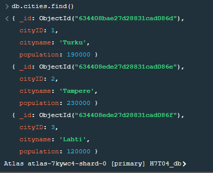
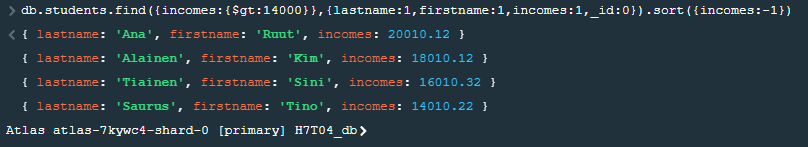
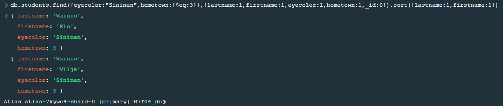
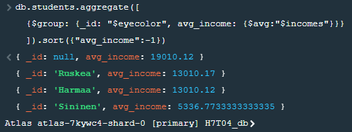

### LUODAAN FUNKTIOT TIETUEIDEN JA DATAN LISÄÄMISEEN


// Kaupungit  
```
function insertCities(cID,cn,popu){  
  db.cities.insert(
    { cityID:cID,
      cityname: cn,
      population: popu
    })
}
```
// Kurssit  
```
function insertCourses(cID,coursename,credits){
  db.courses.insert(
    {courseID: cID,
      coursename: coursename,
      credits: credits
    })
}
```
// Opiskelijat  
```
function insertStudent(sID, lname, fname, bdate, eyeclr, inc, tax, town) {
  db.students.insert(
    { studentID : sID ,
      lastname : lname ,
      firstname : fname,
      birthdate : bdate,
      eyecolor : eyeclr,
      incomes : inc,
      taxrate : tax,
      hometown : town }
    )
}
```
// Arvosanat  
```
function insertGrades(sID, cID, date, num) {
  db.studentgrades.insert(
    { studentID : sID ,
      courseID : cID ,
      date_created : date,
      grade : num }
    )
}
```
### LISÄTÄÄN DATA TIETUEISIIN

// Kaupungit
```
insertCities(1, "Turku", 190000),
insertCities(2, "Tampere", 230000),
insertCities(3,"Lahti",120000)
```
// Kurssit
```
insertCourses(1, "Ohjelmointi",5),
insertCourses(2,"Tietokannat",4),
insertCourses(3,"Ruotsi",3)
```
// Opiskelijat
```
insertStudent(2001, 'Guru',     'Ken',   '2001-11-11', 'Ruskea',  12010.12, 5.1, 1),
insertStudent(2002, 'Saurus',   'Tino',  '2002-11-11', 'Ruskea',  14010.22, 6.2, 1),
insertStudent(2003, 'Tiainen',  'Sini',  '2003-11-11', 'Sininen', 16010.32, 7.3, 1),
insertStudent(2004, 'Vainio',   'Vilja', '2004-11-11', 'Sininen', 0.00,     0.0, 3),
insertStudent(2005, 'Vainio',   'Elo',   '2005-11-11', 'Sininen', 0.00,     0.0, 3),
insertStudent(2006, 'Rahainen', 'Muu',   '2006-11-11', 'Harmaa',  13010.12, 5.8, 2),
insertStudent(2007, 'Alainen',  'Kim',   '2007-11-11',  null,     18010.12, 8.8, 2),
insertStudent(2008, 'Ana',      'Ruut',  '2008-11-11',  null,     20010.12, 9.9, null);
```
// Arvosanat
```
insertGrades(2001, 1, '2018-11-11', 5),
insertGrades(2001, 2, '2019-11-11', 5),
insertGrades(2001, 3, '2020-11-11', 5),

insertGrades(2002, 1, '2018-11-11', 4),
insertGrades(2002, 2, '2019-11-11', 4),
insertGrades(2002, 3, '2020-11-11', 4),

insertGrades(2003, 1, '2018-11-11', 3),
insertGrades(2003, 2, '2019-11-11', 4),
insertGrades(2003, 3, '2020-11-11', 4),

insertGrades(2004, 3, '2020-11-11', 1),

insertGrades(2005, 3, '2020-11-11', 1),

insertGrades(2006, 1, '2018-11-11', 2),
insertGrades(2006, 2, '2019-11-11', 2),
insertGrades(2006, 3, '2020-11-11', 3),

insertGrades(2007, 1, '2018-11-11', 3),
insertGrades(2007, 2, '2019-11-11', 4),

insertGrades(2008, 1, '2018-11-11', 4),
insertGrades(2008, 2, '2019-11-11', 5);
```

### KYSELYT

#### Kysely 1
```
db.cities.find()
```

#### Kysely 2  
```
db.students.find({incomes:{$gt:14000}},{lastname:1,firstname:1,incomes:1,_id:0}).sort({incomes:-1})
```

#### Kysely 3
```
db.students.find({eyecolor:"Sininen",hometown:{$eq:3}},{lastname:1,firstname:1,eyecolor:1,hometown:1,_id:0}).sort({lastname:1,firstname:1})
```

#### Kysely 4
```
db.students.aggregate([
  {$group: {_id: "$eyecolor", avg_income: {$avg:"$incomes"}}}
  ]).sort({"avg_income":-1})
```
